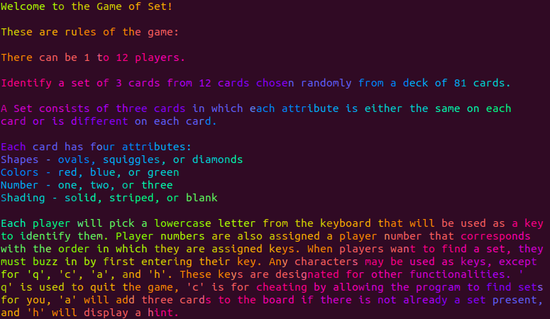

# Game of Set

### Installations
* Before running this game, the **colorize** and **lolize** gems must be installed. On Ubuntu or Windows, run the following commands:
  * ```gem install lolize``` 
  
  * ```gem install colorize```
  
    * _Note:_ You may need to use the ```sudo``` command to install gems.
* **Ruby** must also be installed to run this game.

### Rules of the Game

  
 ### Playing the Game
 * To run the game in the terminal, first ```cd``` in to the ```lib``` directory and run the command ```ruby main.rb```
 * Enter number of players, between 1 to 12
 * Assign a key to each player (cannot use keys 'q', 'c', 'a', or 'h')
 * A player must press their designated key to buzz in and find a set (enter 3 card numbers)
 * The player will be notified if the 3 cards they entered form a set or not
 * The score will update and the game will continue until a player hits 'a' or all sets are found
 * Game statistics will appear at the end of the game, displaying each player's score and the total time it took them to find sets

### Functionality
* Timer - a timer is used to show the total time each player's turn takes, as well as the total time the game is played at the end of the game. A player's turn begins when they buzz in using their player key and ends when the games verfies that their selection is or is not a set.
* Hint - a player may ask for a hint by pressing the 'h' key, which will tell them the number of sets that exist amongst the cards  currently displayed on the board.
* Cheat - a player may cheat by pressing the 'c' key, which will identify and print all cards of every potential set amongst the cards on the board.
* Quit - a player may quit the game before all the sets are found by pressing the 'q' key.
* Adding 3 cards - a player may add 3 cards to the board by pressing the 'a' key. This will only be allowed if there are no sets on the board.
* Multiplayer - the number of players is identified at the beginning of the game. The game will allow up to 12 players.
* Tie Breaker - if players have the same score when the game ends, the player with the shortest total player turn time will win.
* Winner - the winner is displayed after the game prematurely quits (pressing 'q') or when the board has no more sets.

### Testing
- To find our test cases, first ```cd``` in to the ```test``` directory. Then, run the ```ruby``` command on any test file.
- Each of our test cases passed for every method that we tested.
- ```main.rb```  was not included in our test cases because it only asks for I/O and calls to functions from the classes tested.

### Contributions
- Jessica McNeill: Wrote most of the README.md file and created all 81 card images. Cleaned up coding and style errors for all of our classes with RuboCop. Researched colorize and lolize gems to beautify our text-based game. Implemented parts of the deck.rb class and the winners method/logic. Helped Aiko and Liam with some of the test cases. Cleaned up and implemented gems on the game's terminal output with Sarah.  Debugged and wrote code with the group.
- Aiko Zhao: Conducted independent research for TK, shoes, and other GUI formats or gems to use for the team. Implemented parts of the cards.rb and deck.rb class. Wrote code for test cases along with Liam, helped with general logic.
- Sarah Zhang: Organized and communicated team meetings. Organized file/code structure in our repo. Wrote all card-related methods in deck.rb, wrote parts of cards.rb, and implemented foundational game logic in game.rb. Implemented colorize and lolize gems while making the game's console output more aesthetically pleasing with Jessica. Debugged game errors with entire team.
- Liam Gallagher: Wrote the majority of the logic that runs the game in main.rb, including setting up the player's buzzer system, verifying valid user inputs, and writing game-specific logic. Implemented the players.rb class as well as parts of the game.rb class. Wrote testing code for all classes with Aiko. Debugged game errors with the entire team.


 
